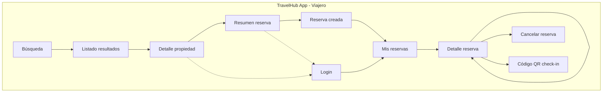

# TravelHub – Mobile Prototype Specification

**Document purpose:** Single source of information to build the **mobile app prototype** (iOS/Android or cross-platform) for travelers.  
**Sources:** [MISW4501 Proyecto Final PDF](MISW4501-202611-ProyectoFinal.pdf), [Jira backlog PFG1](https://projecto-final-1-grupo-11-uniandes.atlassian.net/jira/software/projects/PFG1/boards/37/backlog).

---

## 1. Project context

- **TravelHub:** Digital platform for hotel and tour reservations in 6 countries (Colombia, Perú, Ecuador, México, Chile, Argentina). It connects hotels, hostels, tour operators, travel agencies, and travelers.
- **Mobile scope for prototype (Semana 16):**
  - Búsqueda de hospedaje.
  - Detalle de propiedad y creación de reserva.
  - Visualización de reservas (incluyendo soporte offline para listado/detalle).
  - Notificaciones push para cambios de estado.
  - Check-in mediante código QR (si aplica).

---

## 2. Target users (mobile)

| User type | Main goals |
|-----------|------------|
| Viajero (traveler) | Buscar alojamiento, ver detalle, reservar, ver/cancelar reservas, check-in con QR, recibir notificaciones de estado. |

---

## 2.1 Navigation map (mobile)

Single app for travelers. Main flows: **Search → Property → Reserve** and **My reservations → Detail → Cancel / QR check-in**. Push notifications open the app (e.g. to reservation detail).

| Screen / module | Description |
|------------------|-------------|
| **Búsqueda** | City, check-in/out, guests. "Buscar" → Listado resultados (cached when offline). |
| **Listado resultados** | Cards; filters & sort (sheet or screen). Pull-to-refresh. Tap card → Detalle propiedad. |
| **Detalle propiedad** | Gallery, description, amenities, reviews, rates. CTA "Reservar" → Resumen reserva (or Login). |
| **Resumen reserva** | Room, dates, guests, total. "Confirmar" → success (requires connection). |
| **Reserva creada** | Success state; link to Mis reservas. |
| **Login** | Required for Mis reservas and to create a reservation. |
| **Mis reservas** | List (active/past), cached for offline. Tap → Detalle reserva. |
| **Detalle reserva** | Address, confirmation number, dates, room, status. Offline from cache. Actions: Cancelar reserva, Mostrar código QR. |
| **Cancelar reserva** | Confirmation dialog + policy/refund. On confirm → update state and cache. |
| **Código QR check-in** | Full-screen or modal with QR (reservation id). Shown from Detalle reserva when status allows. |

**Cross-cutting:** Push notifications (e.g. "Reserva confirmada", "Estado actualizado") deep-link to Detalle reserva when the user taps the notification.

---

## 3. Epics (mobile)

- **EPICA 1 - Gestión de reservas (Móvil):** PFG1-6  
- **EPICA 2 - Motor de Búsqueda y Disponibilidad Real (Móvil):** PFG1-7  

---

## 4. Motor de búsqueda y disponibilidad (mobile)

### 4.1 Listado y búsqueda

| ID | Summary | Description / Acceptance |
|----|---------|---------------------------|
| **PFG1-33** | HU2.1 Listar hospedajes | **Como** viajero, **cuando** use el motor de búsqueda, **quiero** buscar por ciudad, fechas de entrada/salida y número de personas **para** encontrar opciones que se ajusten a mi viaje. |
| **PFG1-34** | HU2.2 Ver detalle de alojamiento | **Como** viajero, **cuando** seleccione un hospedaje, **quiero** ver el detalle **para** tener información detallada para decidir mi reserva. |
| **PFG1-35** | HU2.3 Aplicar filtros en búsqueda | Filtrar por precio, tipo de alojamiento, calificación y servicios. |
| **PFG1-36** | HU2.4 Ordenar resultados | Ordenar por precio, popularidad o calificación. |
| **PFG1-13** | ARQUITECTURA - Buscar hospedaje | Disponibilidad real; respuesta &lt; 800 ms; no mostrar habitaciones no disponibles; caché con TTL corto; sincronización con PMS; circuit breakers. |

**Prototype implementation notes (mobile):**

- **Pantalla de búsqueda:** Campos ciudad, fecha entrada, fecha salida, número de personas. Botón “Buscar”. Diseño táctil y adaptable a pantalla pequeña.
- **Listado de resultados:** Cards con imagen, nombre, precio, valoración. Pull-to-refresh. Filtros (sheet o pantalla) y orden (precio / popularidad / calificación).
- **Detalle de propiedad:** Scroll con galería, descripción, amenidades, reseñas, habitaciones y precios. Botón fijo “Reservar” (FAB o barra inferior).

---

### 4.2 Offline y sincronización (PDF + Jira)

| Source | Requirement |
|--------|-------------|
| PDF | Búsqueda offline en base de datos caché que se sincroniza automáticamente cuando hay conexión. |
| PFG1-37 | En fallo de proveedor externo: usar caché o proveedores alternos; no interrupciones visibles. |

**Prototype implementation notes (mobile):**

- **Caché local:** Almacenar resultados de búsqueda recientes y detalles de propiedades/habitaciones visitadas (ej. SQLite, Room, o almacenamiento local del framework).
- **Sincronización:** Al tener conexión, actualizar caché en background; en búsqueda offline mostrar datos cacheados con indicador “Datos sin conexión” o “Última actualización: …”.

---

## 5. Gestión de reservas (mobile)

### 5.1 Listado y detalle de reservas (incl. offline)

| ID | Summary | Description / Acceptance |
|----|---------|---------------------------|
| **PFG1-29** | Visualización de listado y detalle de reservas | Como viajero frecuente quiero ver el listado de mis reservas activas y sus detalles en la app, **incluso sin conexión**, para consultar dirección del hotel o número de confirmación cuando estoy viajando o sin datos. |

**Prototype implementation notes (mobile):**

- **Mis reservas:** Listado de reservas (activas/pasadas) con estado, fechas, hotel, imagen. Caché local para uso offline.
- **Detalle de reserva:** Dirección del hotel, número de confirmación, fechas, habitación, precio, estado. Disponible offline desde caché.
- **Indicador de modo offline:** Cuando se muestren datos desde caché, indicar “Sin conexión - Datos guardados” o similar.

---

### 5.2 Creación de reserva (mobile)

| Source | Requirement |
|--------|-------------|
| PDF | Detalle y creación de reserva desde la app; gestión de reservas intuitiva (confirmaciones, itinerarios, cambiar o cancelar). |

**Prototype implementation notes (mobile):**

- Desde detalle de propiedad → “Reservar” → pantalla de resumen (habitación, fechas, huéspedes, total). Requiere conexión para crear reserva.
- Después de confirmar: pantalla de éxito y entrada en “Mis reservas” + notificación/email según backend.

---

### 5.3 Cancelación de reserva (mobile)

| ID | Summary | Description |
|----|---------|-------------|
| **PFG1-31** | Cancelación de reserva | Como usuario quiero cancelar una reserva activa desde el celular para liberar la habitación sin llamar a servicio al cliente. |

**Prototype implementation notes (mobile):**

- En detalle de reserva: botón “Cancelar reserva”. Diálogo de confirmación con política de cancelación y reembolso (si aplica). Tras confirmar, actualizar estado y caché local.

---

## 6. Notificaciones push

| ID | Summary | Description |
|----|---------|-------------|
| **PFG1-32** | Recepción de Notificaciones Push para cambios de estado | Como viajero quiero recibir alertas en el celular cuando mi reserva sea confirmada o sufra algún cambio, para estar seguro sin abrir la app o el correo constantemente. |

**Prototype implementation notes (mobile):**

- Configurar push (FCM/APNs según plataforma). Eventos a notificar: reserva confirmada, reserva cancelada, recordatorio de check-in, etc.
- En el prototipo: al menos “Reserva confirmada” y “Estado de tu reserva ha cambiado” con deep link al detalle de la reserva.

---

## 7. Check-in con código QR

| ID | Summary | Description |
|----|---------|-------------|
| **PFG1-30** | Generación de Código QR para Check-in | Como huésped que llega al hotel quiero generar un código QR único desde el detalle de mi reserva para presentarlo en recepción y agilizar el registro sin dictar datos o buscar papeles. |

**Prototype implementation notes (mobile):**

- En detalle de reserva (estado “Confirmada” o “Check-in disponible”): sección “Check-in” con botón “Mostrar código QR”.
- Al pulsar: pantalla o modal con QR que codifique identificador único de la reserva (y opcionalmente datos mínimos verificables). Tamaño grande y contraste para lectura en recepción.

---

## 8. Non-functional and performance (mobile)

- **Rendimiento (PDF):** Búsqueda &lt; 800 ms, detalle &lt; 500 ms; creación de reserva &lt; 1.5 s; pago &lt; 3 s. En móvil, considerar latencia de red y feedback visual (skeletons, loading).
- **Offline-first (PDF):** Caché para búsqueda y para listado/detalle de reservas; sincronización automática al recuperar conexión.
- **Plataforma:** iOS y Android; se puede usar solución cross-platform (React Native, Flutter) según restricciones del proyecto.

---

## 9. Data and integration assumptions (mobile)

- **API:** Misma API que el portal web para búsqueda, propiedad, reservas, pagos (si el pago se hace desde la app en el prototipo).
- **Autenticación:** Login (email/contraseña o OAuth) para “Mis reservas”, crear reserva y pagar. Tokens seguros en dispositivo.
- **Monedas:** Misma lógica que web (USD, ARS, CLP, PEN, COP, MXN) según país del usuario.
- **Push:** Servidor envía notificaciones al dispositivo; app debe registrar token y manejar permisos.

---

## 10. Jira mapping (mobile)

- **EPICA 1 - Gestión de reservas (Móvil):** PFG1-6 → PFG1-29, PFG1-30, PFG1-31, PFG1-32 (listado/detalle offline, QR check-in, cancelación, push).
- **EPICA 2 - Motor de Búsqueda y Disponibilidad Real (Móvil):** PFG1-7 → PFG1-33, PFG1-34, PFG1-35, PFG1-36, PFG1-13 (búsqueda, detalle, filtros, orden, arquitectura).

---

## 11. Out of scope for mobile prototype (or later phase)

- Portal de hoteles en móvil (el enunciado lo define como web).
- Pagos in-app completos con múltiples proveedores (se puede dejar “Pagar en web” o un flujo mínimo con un proveedor).
- Modificación de fechas/huéspedes de una reserva (PDF lo menciona; prioridad menor si el foco es listado, detalle, cancelación y QR).

---

## 12. Checklist for mobile prototype build

- [ ] Búsqueda por ciudad, fechas, número de personas.
- [ ] Listado de resultados con filtros (precio, tipo, calificación, servicios) y orden (precio, popularidad, calificación).
- [ ] Detalle de propiedad (imágenes, descripción, amenidades, reseñas, precios/habitaciones).
- [ ] Caché de búsqueda y sincronización cuando hay conexión.
- [ ] Creación de reserva desde el detalle (flujo completo o redirección a pago web según decisión).
- [ ] Pantalla “Mis reservas” con listado (funcionando offline desde caché).
- [ ] Detalle de reserva con dirección, número de confirmación y opción de cancelar (offline para lectura).
- [ ] Cancelación de reserva con confirmación y política/reembolso.
- [ ] Generación de código QR para check-in desde detalle de reserva.
- [ ] Notificaciones push para cambios de estado (confirmación, cambio de estado, etc.).
- [ ] Indicadores claros de modo offline cuando se usen datos cacheados.

---

*Document generated from project description (MISW4501 Proyecto Final) and Jira backlog PFG1. Last sync: backlog as of conversation date.*
