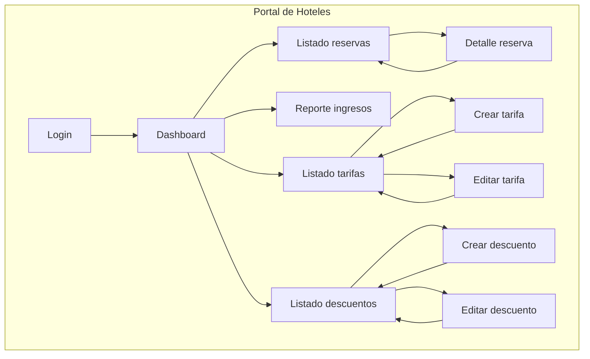
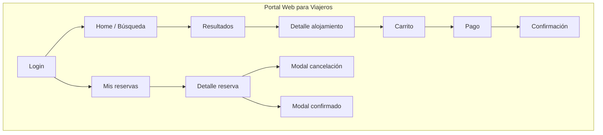

# TravelHub – Web Prototype Specification

**Document purpose:** Single source of information to build the **web client prototype** (Portal de Hoteles for hotel administration + Portal Web para Viajeros for travelers).
**Sources:** [MISW4501 Proyecto Final PDF](MISW4501-202611-ProyectoFinal.pdf), [Jira backlog PFG1](https://projecto-final-1-grupo-11-uniandes.atlassian.net/jira/software/projects/PFG1/boards/37/backlog).

---

## 1. Project context

- **TravelHub:** Digital platform for hotel and tour reservations in 6 countries (Colombia, Perú, Ecuador, México, Chile, Argentina). It connects hotels, hostels, tour operators, travel agencies, and travelers.
- **Web scope for prototype (Semana 16):**
  - **Portal de Hoteles (Backend + Frontend):** Login, reservations dashboard, reservation detail (confirm/reject), monthly revenue report, rate management (create, edit, discounts).
  - **Portal Web para Viajeros (Frontend):** Login, search/list accommodations, filters & sort, hotel detail, cart, payment, confirmation, my reservations, reservation detail, cancellation with refund, payment history.

---

## 2. Target users (web)

| User type | Portal | Main goals |
|-----------|--------|------------|
| Administrador de hotel | Portal de Hoteles | Login, see/manage reservations, confirm/reject, see revenue report, manage rates and discounts. |
| Viajero | Portal Web para Viajeros | Login, search accommodations, view hotel details, make reservations, pay, view my reservations, cancel with refund. |

---

## 2.1 Navigation map (web)

### Portal de Hoteles – Administrador de hotel

| Page / module | Description |
|----------------|-------------|
| **Login** | Credentials → redirect to Dashboard. |
| **Dashboard** | Hub with links to Reservas, Reportes, Tarifas, Descuentos. |
| **Listado reservas** | Table/list with filters (date, status). Row click → Detalle reserva. |
| **Detalle reserva** | Guest, dates, room, status. Actions: Confirmar, Rechazar. |
| **Reporte ingresos** | Month (and year) selector. Chart + table. Optional: download PDF/Excel. |
| **Listado tarifas** | By room/type. Actions: Crear tarifa, Editar tarifa. |
| **Crear / Editar tarifa** | Form: price, currency, room. Save → back to list. |
| **Listado descuentos** | By tariff. Actions: Crear, Editar, Eliminar. |
| **Crear / Editar descuento** | Form: percentage, validity dates. Save → back to list. |

### Portal Web para Viajeros – Viajero

| Page / module | Description |
|----------------|-------------|
| **Login** | Credentials → redirect to Home. |
| **Home / Búsqueda** | Search bar with destination, dates, guests. Featured hotels. |
| **Resultados** | List of matching hotels with filters (price, rating, amenities) and sort options. |
| **Detalle alojamiento** | Hotel info, rooms, reviews, gallery, location. Select room → add to cart. |
| **Carrito** | Selected rooms, dates, price summary. Proceed to payment. |
| **Pago** | Payment method selection, billing info. Confirm → process payment. |
| **Confirmación** | Success screen with reservation summary and next steps. |
| **Mis reservas** | List of user's reservations with status and dates. |
| **Detalle reserva** | Full reservation info, hotel, room, payment history. Cancel button. |
| **Modal cancelación** | Cancellation policy, refund breakdown, confirm cancellation. |
| **Modal confirmado** | Payment confirmation overlay with reservation summary and email notification. |

---

## 3. Portal de Hoteles – Functional requirements

### 3.1 Autenticación y acceso

| ID | Summary | Description |
|----|---------|-------------|
| **PFG1-18** | HU3.1 – Iniciar sesión en el portal administrativo | Como administrador de hotel quiero iniciar sesión en el portal para acceder a la gestión de mi hotel. |

**Prototype:** Página de login (usuario/email + contraseña). Tras login, redirigir al dashboard de reservas.

---

### 3.2 Dashboard y reservas

| ID | Summary | Description |
|----|---------|-------------|
| **PFG1-19** | HU3.2 – Ver listado de reservas del hotel | Ver listado de reservas del hotel para conocer la ocupación actual. |
| **PFG1-22** | HU3.3 – Ver detalle de una reserva | Ver detalle de una reserva para revisar fechas y datos del huésped. |
| **PFG1-20** | HU3.4 – Confirmar o rechazar una reserva | Confirmar o rechazar una reserva para aceptar la ocupación del alojamiento. |

**Prototype:** Listado de reservas con filtros (fecha, estado). Clic en una reserva → detalle (huésped, fechas, habitación, estado). Botones "Confirmar" y "Rechazar".

---

### 3.3 Reporte de ingresos

| ID | Summary | Description |
|----|---------|-------------|
| **PFG1-15** | ARQUITECTURA - HUA3.2 - Generar reporte de reserva | Como hotel partner, al generar reporte mensual de ingresos, obtener descarga en < 3 s con datos del período. |
| **PFG1-25** | HU3.11 – Consultar reporte de ingresos mensual | Consultar reporte de ingresos por mes para analizar el desempeño financiero. |

**Prototype:** Sección "Reportes" o "Ingresos". Selector de mes (y opcionalmente año). Gráfico + tabla de ingresos. Descarga en PDF/Excel (opcional para prototipo).

---

### 3.4 Gestión de tarifas y descuentos

| ID | Summary | Description |
|----|---------|-------------|
| **PFG1-23** | HU3.6 – Crear una tarifa | Crear tarifa para una habitación (precio base por noche). |
| **PFG1-24** | HU3.7 – Editar una tarifa | Editar tarifa existente para actualizar precio base. |
| **PFG1-26** | HU3.8 – Crear descuento sobre una tarifa | Crear descuento asociado a una tarifa para promociones temporales. |
| **PFG1-27** | HU3.9 – Editar descuento | Editar descuento (porcentaje o vigencia). |
| **PFG1-28** | HU3.10 – Eliminar descuento | Eliminar descuento para finalizar una promoción. |

**Prototype:** Sección "Tarifas": listado por habitación/tipo; "Crear tarifa" / "Editar tarifa" (precio, moneda). Sección "Descuentos": listado por tarifa; crear/editar/eliminar (porcentaje, fechas de vigencia).

---

## 4. Portal Web para Viajeros – Functional requirements

### 4.1 Autenticación

| ID | Summary | Description |
|----|---------|-------------|
| *(from PDF)* | Login usuario viajero | Como viajero quiero iniciar sesión para acceder a mis reservas y realizar nuevas búsquedas. |

**Prototype:** `login.html` — login con email/contraseña. Tras login, redirigir a Home.

---

### 4.2 Búsqueda y exploración de hospedajes

| ID | Summary | Description |
|----|---------|-------------|
| **PFG1-33** | HU2.1 – Listar hospedajes disponibles | Como viajero quiero ver un listado de hospedajes disponibles para elegir dónde alojarme. |
| **PFG1-35** | HU2.3 – Aplicar filtros de búsqueda | Como viajero quiero filtrar resultados por precio, rating, amenidades para encontrar el hospedaje ideal. |
| **PFG1-36** | HU2.4 – Ordenar resultados | Como viajero quiero ordenar los resultados (precio, rating) para comparar opciones fácilmente. |

**Prototype:** `home.html` — barra de búsqueda (destino, fechas, huéspedes) y hoteles destacados. `results.html` — listado de resultados con filtros laterales (precio, estrellas, amenidades) y opciones de ordenamiento (precio, rating).
**Domain entities:** Hotel, Room, Inventory, Address, Tariff (basePrice), amenities, rating.

---

### 4.3 Detalle de alojamiento

| ID | Summary | Description |
|----|---------|-------------|
| **PFG1-34** | HU2.2 – Ver detalle de alojamiento | Como viajero quiero ver el detalle de un alojamiento para conocer habitaciones, ubicación y reseñas. |

**Prototype:** `property-detail.html` — información del hotel, galería, habitaciones disponibles, reseñas, ubicación en mapa. Botón de seleccionar habitación → carrito.
**Domain entities:** Hotel, Room, Review, Address, Tariff.

---

### 4.4 Carrito y reserva

| ID | Summary | Description |
|----|---------|-------------|
| **PFG1-11** | Confirmar reserva | Como viajero quiero confirmar mi reserva para asegurar la disponibilidad del alojamiento. |

**Prototype:** `cart.html` — resumen de habitaciones seleccionadas, fechas, desglose de precio. Botón "Proceder al pago".
**Domain entities:** Cart, Reservation, Room, Inventory.

---

### 4.5 Pago

| ID | Summary | Description |
|----|---------|-------------|
| **PFG1-10** | Realizar pago de reserva | Como viajero quiero realizar el pago de mi reserva para completar la transacción. |
| **PFG1-39** | HU4.1 – Seleccionar método de pago | Como viajero quiero seleccionar un método de pago (tarjeta crédito/débito) para pagar mi reserva. |

**Prototype:** `payment.html` — formulario de pago (método, datos de tarjeta), resumen del pedido. Botón "Confirmar pago".
**Domain entities:** Payment (amount, currency, method).

---

### 4.6 Confirmación de pago

| ID | Summary | Description |
|----|---------|-------------|
| **PFG1-44** | HU4.6 – Confirmación de pago | Como viajero quiero recibir confirmación del pago para saber que mi reserva fue procesada exitosamente. |

**Prototype:** `confirmation.html` — pantalla de éxito con resumen de reserva. `reservation-confirmed.html` — modal de confirmación sobre el detalle de reserva con resumen, email de notificación y próximos pasos.
**Domain entities:** Reservation, Payment.

---

### 4.7 Mis reservas y detalle

| ID | Summary | Description |
|----|---------|-------------|
| *(from PDF)* | Consulta de mis reservas | Como viajero quiero ver el listado de mis reservas para hacer seguimiento de mis viajes. |
| **PFG1-43** | HU4.5 – Ver historial de pagos | Como viajero quiero ver el historial de pagos de una reserva para conocer los movimientos realizados. |

**Prototype:** `my-reservations.html` — listado de reservas del usuario con estado, hotel y fechas. `reservation-detail.html` — detalle completo de la reserva (hotel, habitación, fechas, huéspedes) con sección de historial de pagos y opción de cancelación.
**Domain entities:** User, Reservation, Hotel, Room, Payment.

---

### 4.8 Cancelación y reembolso

| ID | Summary | Description |
|----|---------|-------------|
| **PFG1-41** | HU4.3 – Generar reembolso por cancelación | Como viajero quiero cancelar mi reserva y obtener un reembolso según la política de cancelación. |

**Prototype:** `reservation-cancel.html` — modal sobre el detalle de reserva con política de cancelación aplicada, desglose de reembolso, método de devolución y timeline estimado. Botones "Volver" y "Confirmar cancelación".
**Domain entities:** Reservation, Payment.

---

### Functional areas summary

| Area | Backlog stories | Prototype screen(s) | Domain entities |
|------|----------------|----------------------|-----------------|
| Auth | *(from PDF)* | `login.html` | User |
| Search | PFG1-33 | `home.html`, `results.html` | Hotel, Room, Inventory, Address, Tariff |
| Filters & sort | PFG1-35, PFG1-36 | `results.html` | Hotel (amenities, rating), Tariff (basePrice) |
| Hotel detail | PFG1-34 | `property-detail.html` | Hotel, Room, Review, Address, Tariff |
| Cart & reservation | PFG1-11 | `cart.html` | Cart, Reservation, Room, Inventory |
| Payment | PFG1-10, PFG1-39 | `payment.html` | Payment (amount, currency, method) |
| Confirmation | PFG1-44 | `confirmation.html`, `reservation-confirmed.html` | Reservation, Payment |
| My reservations | *(from PDF)* | `my-reservations.html` | User, Reservation, Hotel |
| Reservation detail | *(from PDF)* | `reservation-detail.html` | Reservation, Hotel, Room, Payment |
| Cancellation + refund | PFG1-41 | `reservation-cancel.html` | Reservation, Payment |
| Payment history | PFG1-43 | `reservation-detail.html` (payment section) | Payment |

---

## 5. Non-functional and performance (relevant for prototype)

- **Rendimiento (PDF + Jira):** Reporte de ingresos descarga < 3 s, histórico reservas < 1 s.
- **Seguridad:** TLS 1.2+, autenticación de administradores y viajeros.
- **Disponibilidad:** Para prototipo se puede asumir un solo entorno; las historias de escalado (PFG1-14) y resiliencia (PFG1-37, PFG1-38) orientan el diseño del backend más que la UI.

---

## 6. Data and integration assumptions (web)

- **Monedas:** USD, ARS, CLP, PEN, COP, MXN (moneda según país del hotel).
- **Roles:** Administrador de hotel (portal hoteles), Viajero (portal viajeros). RBAC si aplica en backend.

---

## 7. Jira epics mapping (web)

- **EPICA 2 - Búsqueda y Reservas (Web Viajero):** PFG1-7 → cubierto por HU2.x (PFG1-33, PFG1-34, PFG1-35, PFG1-36) y PFG1-11.
- **EPICA 3 - Gestión Administrativa de Hoteles (Web):** PFG1-8 → cubierto por HU3.x (PFG1-18 a PFG1-28) y PFG1-15.
- **EPICA 4 - Gestión de Pagos (Web Viajero):** PFG1-9 → cubierto por HU4.x (PFG1-10, PFG1-39, PFG1-41, PFG1-43, PFG1-44).

---

## 8. Out of scope for web prototype (or later phase)

- Portal para agencias de viaje.
- Integración real con múltiples PMS (puede simularse o usarse un solo backend de inventario).
- Reportes avanzados (múltiples formatos, API para terceros) más allá del reporte mensual de ingresos.
- MFA obligatorio en el primer prototipo (opcional según PDF).
- Wishlist / favoritos (no existe en el modelo de dominio).
- Chat / mensajería en tiempo real (caja de contacto en UI es estática).
- Programas de fidelidad / puntos de recompensa.
- Códigos de cupón / vouchers (solo existe Tariff.discount en el dominio).
- Agrupación de itinerarios de viaje.
- Configuración multi-idioma (solo UI, no es funcionalidad del dominio).
- Edición de perfil de usuario.

---

## 9. Checklist for web prototype build

### Portal de Hoteles
- [ ] Login.
- [ ] Dashboard con KPIs y acceso rápido.
- [ ] Listado y detalle de reservas; confirmar/rechazar.
- [ ] Reporte de ingresos mensual (gráfico + tabla).
- [ ] CRUD tarifas y descuentos.

### Portal Web para Viajeros
- [ ] Login viajero.
- [ ] Home con búsqueda (destino, fechas, huéspedes).
- [ ] Resultados con filtros y ordenamiento.
- [ ] Detalle de alojamiento (hotel, habitaciones, reseñas).
- [ ] Carrito de reserva.
- [ ] Pago (selección de método, formulario).
- [ ] Confirmación de pago / reserva.
- [ ] Mis reservas (listado).
- [ ] Detalle de reserva con historial de pagos.
- [ ] Cancelación con reembolso (modal).

---

*Document generated from project description (MISW4501 Proyecto Final) and Jira backlog PFG1. Last sync: backlog as of conversation date.*
