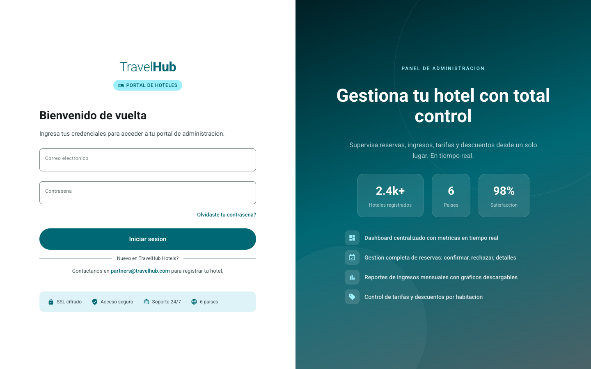
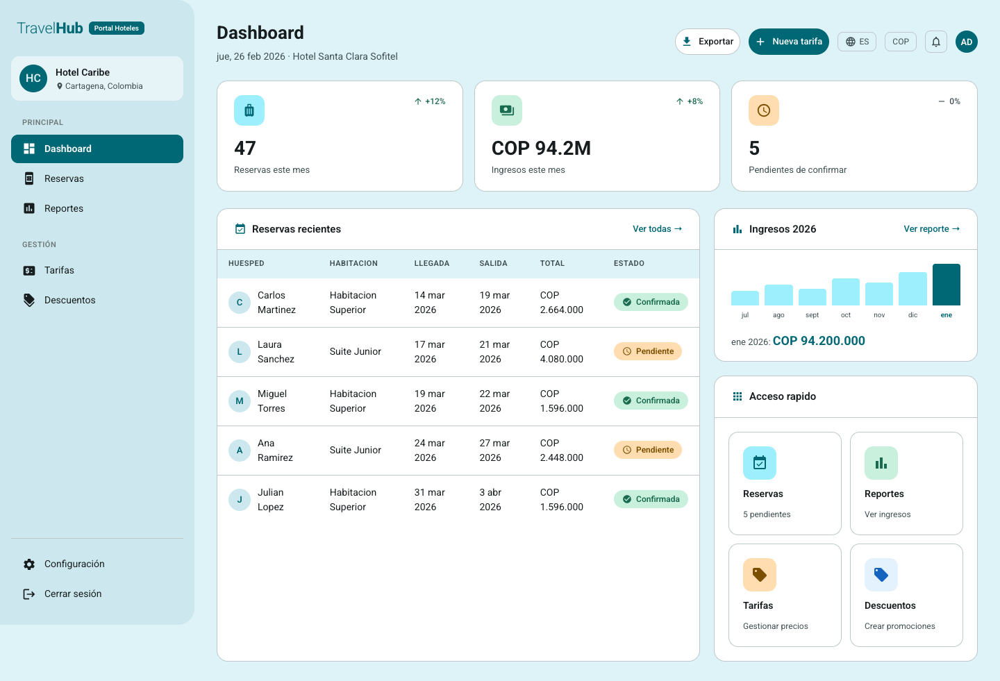
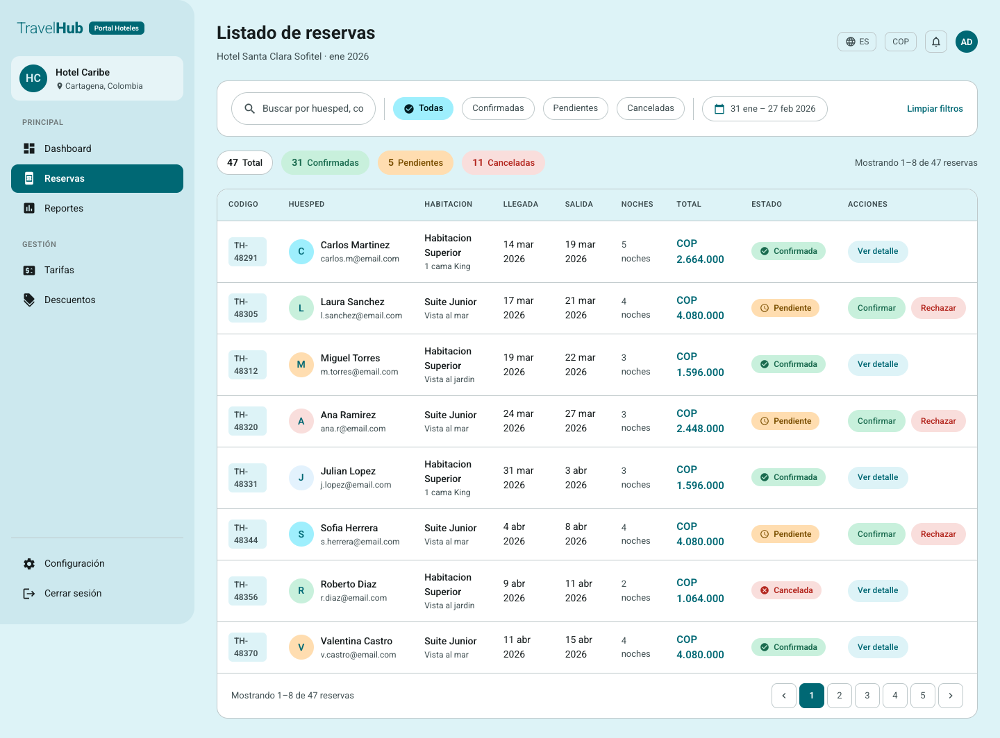
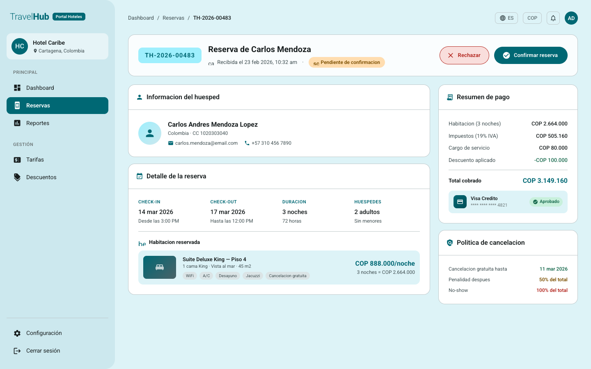
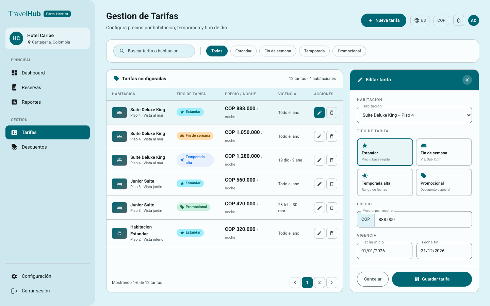
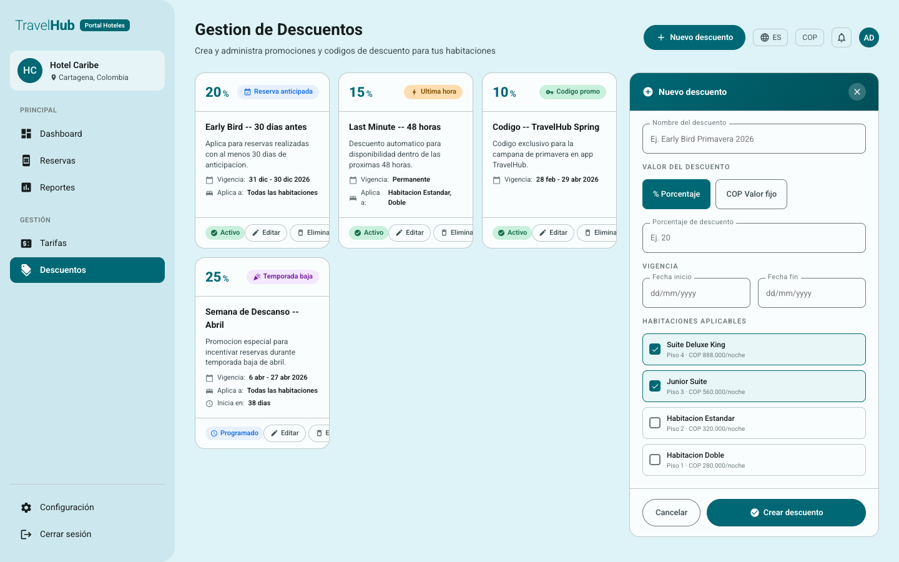
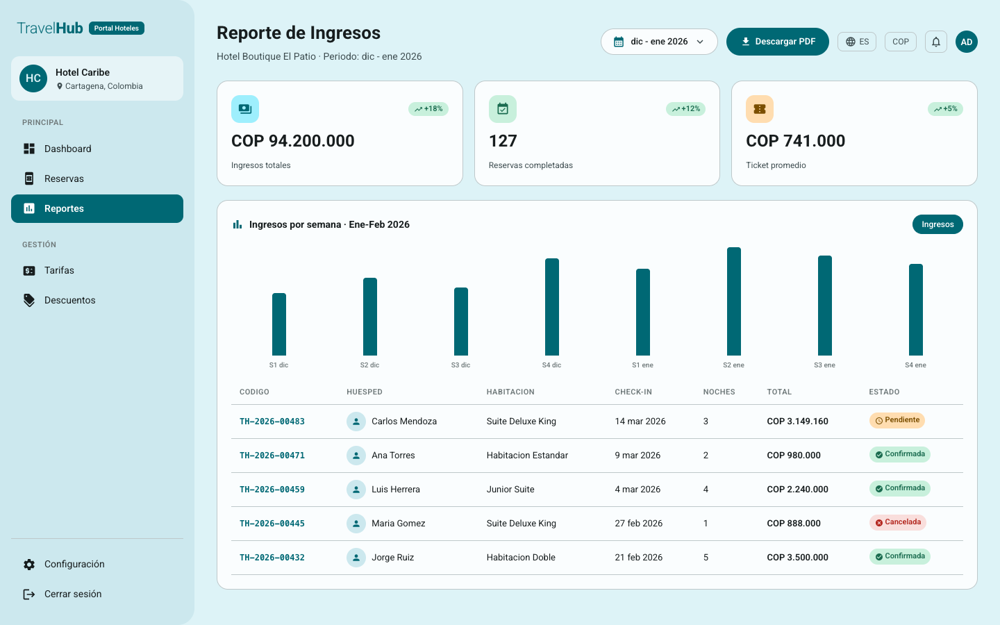

# Manual de Usuario — Portal de Hoteles (Administrador)

## Introducción

El Portal de Hoteles de TravelHub es la herramienta de administración para gestionar su alojamiento dentro de la plataforma. Desde este portal podrá consultar y gestionar reservas, confirmar o rechazar solicitudes de huéspedes, administrar tarifas y descuentos, y consultar reportes de ingresos mensuales.

## Requisitos previos

- Navegador web actualizado (Chrome, Firefox, Safari o Edge).
- Conexión a internet.
- Cuenta de administrador de hotel registrada en TravelHub (correo electrónico y contraseña).

---

## 1. Inicio de sesión

### Descripción
Permite acceder al portal administrativo con sus credenciales de administrador de hotel.

### Paso a paso
1. Abra el Portal de Hoteles de TravelHub en su navegador.
2. Ingrese su correo electrónico en el campo **Email**.
3. Ingrese su contraseña en el campo **Contraseña**.
4. Haga clic en el botón **Iniciar sesión**.
5. Será redirigido al Dashboard principal.

### Captura de pantalla

---

## 2. Dashboard

### Descripción
Panel principal del portal que presenta un resumen general del hotel con indicadores clave (KPIs) y accesos directos a las secciones principales: Reservas, Reportes, Tarifas y Descuentos.

### Paso a paso
1. Al iniciar sesión, accederá automáticamente al Dashboard.
2. Revise los **indicadores clave** de ocupación e ingresos.
3. Utilice los **accesos directos** para navegar a:
   - **Reservas**: gestión de reservas del hotel.
   - **Reportes**: consulta de ingresos mensuales.
   - **Tarifas**: administración de precios por habitación.
   - **Descuentos**: gestión de promociones y descuentos.

### Captura de pantalla

---

## 3. Listado de reservas

### Descripción
Muestra una tabla con todas las reservas del hotel. Permite filtrar por fecha y estado para conocer la ocupación actual y gestionar las solicitudes de los huéspedes.

### Paso a paso
1. Acceda a la sección **Reservas** desde el Dashboard o el menú lateral.
2. Revise la tabla de reservas con las columnas: huésped, fechas, habitación y estado.
3. Use los **filtros** para buscar por:
   - Rango de fechas.
   - Estado de la reserva (pendiente, confirmada, rechazada, cancelada).
4. Haga clic en cualquier fila para ver el detalle completo de la reserva.

### Captura de pantalla

---

## 4. Detalle de reserva (confirmar/rechazar)

### Descripción
Presenta la información completa de una reserva: datos del huésped, fechas de estadía, habitación asignada y estado actual. Desde aquí puede confirmar o rechazar la reserva.

### Paso a paso
1. Desde el listado de reservas, haga clic en una reserva para abrir su detalle.
2. Revise los **datos del huésped** (nombre, contacto).
3. Verifique las **fechas** de entrada y salida.
4. Consulte la **habitación** asignada y el monto.
5. Para aceptar la reserva, haga clic en **Confirmar**.
6. Para rechazar la reserva, haga clic en **Rechazar**.
7. Será redirigido al listado de reservas con el estado actualizado.

### Captura de pantalla

---

## 5. Gestión de tarifas

### Descripción
Permite administrar las tarifas (precios base por noche) de las habitaciones del hotel. Puede crear nuevas tarifas, editar las existentes y asignarlas por tipo de habitación y moneda.

### Paso a paso
1. Acceda a la sección **Tarifas** desde el Dashboard o el menú lateral.
2. Revise el listado de tarifas organizadas por habitación o tipo de habitación.
3. Para **crear una nueva tarifa**:
   - Haga clic en **Crear tarifa**.
   - Complete el formulario: precio base, moneda y tipo de habitación.
   - Haga clic en **Guardar**.
4. Para **editar una tarifa existente**:
   - Haga clic en el botón de edición junto a la tarifa.
   - Modifique el precio o la moneda según sea necesario.
   - Haga clic en **Guardar** para aplicar los cambios.

### Captura de pantalla

---

## 6. Gestión de descuentos

### Descripción
Permite crear, editar y eliminar descuentos asociados a las tarifas del hotel para ofrecer promociones temporales a los viajeros.

### Paso a paso
1. Acceda a la sección **Descuentos** desde el Dashboard o el menú lateral.
2. Revise el listado de descuentos activos organizados por tarifa.
3. Para **crear un nuevo descuento**:
   - Haga clic en **Crear descuento**.
   - Complete el formulario: porcentaje de descuento, tarifa asociada y fechas de vigencia (inicio y fin).
   - Haga clic en **Guardar**.
4. Para **editar un descuento**:
   - Haga clic en el botón de edición junto al descuento.
   - Modifique el porcentaje o las fechas de vigencia.
   - Haga clic en **Guardar**.
5. Para **eliminar un descuento**:
   - Haga clic en el botón de eliminar junto al descuento que desea finalizar.
   - Confirme la eliminación en el diálogo de confirmación.

### Captura de pantalla

---

## 7. Reportes de ingresos

### Descripción
Permite consultar un reporte de ingresos mensuales del hotel con visualización gráfica y tabla de datos. Útil para analizar el desempeño financiero y la ocupación del alojamiento.

### Paso a paso
1. Acceda a la sección **Reportes** desde el Dashboard o el menú lateral.
2. Seleccione el **mes** y opcionalmente el **año** que desea consultar.
3. Revise el **gráfico de ingresos** que muestra la evolución durante el período seleccionado.
4. Consulte la **tabla de datos** con el desglose detallado de ingresos.
5. Opcionalmente, haga clic en **Descargar** para exportar el reporte en formato PDF o Excel.

### Captura de pantalla

