# Manual de Usuario — App Móvil para Viajeros

## Introducción

La aplicación móvil de TravelHub permite a los viajeros buscar y reservar hospedaje desde su teléfono celular. Ofrece funcionalidades como búsqueda de alojamiento, gestión de reservas, cancelación, check-in mediante código QR y consulta de reservas incluso sin conexión a internet. Disponible para iOS y Android.

## Requisitos previos

- Dispositivo móvil con sistema operativo iOS o Android actualizado.
- Conexión a internet (algunas funciones están disponibles sin conexión).
- Cuenta de usuario registrada en TravelHub (correo electrónico y contraseña).

---

## 1. Inicio de sesión

### Descripción
Permite acceder a la aplicación con sus credenciales para gestionar reservas y realizar nuevas búsquedas.

### Paso a paso
1. Abra la aplicación TravelHub en su dispositivo móvil.
2. Ingrese su correo electrónico en el campo **Email**.
3. Ingrese su contraseña en el campo **Contraseña**.
4. Toque el botón **Iniciar sesión**.
5. Será dirigido a la pantalla de búsqueda.

### Captura de pantalla
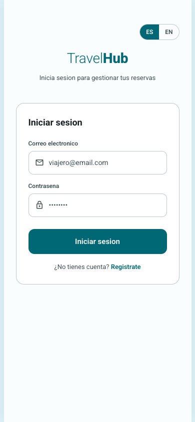

---

## 2. Registro de cuenta

### Descripción
Si no tiene una cuenta en TravelHub, puede crear una directamente desde la aplicación móvil.

### Paso a paso
1. En la pantalla de inicio de sesión, toque el enlace **Registrarse** o **Crear cuenta**.
2. Complete los campos requeridos: nombre, correo electrónico y contraseña.
3. Toque el botón **Registrarse** para crear su cuenta.
4. Una vez registrado, será redirigido para iniciar sesión.

### Captura de pantalla
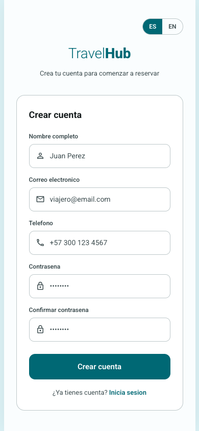

---

## 3. Búsqueda de hospedaje

### Descripción
Permite buscar alojamientos disponibles ingresando la ciudad de destino, fechas de viaje y número de huéspedes. Los resultados de búsquedas recientes se almacenan en caché para consulta sin conexión.

### Paso a paso
1. En la pantalla de búsqueda, ingrese la **ciudad** de destino.
2. Seleccione la **fecha de entrada** y la **fecha de salida**.
3. Indique el **número de huéspedes**.
4. Toque el botón **Buscar**.
5. Será dirigido al listado de resultados.

### Captura de pantalla
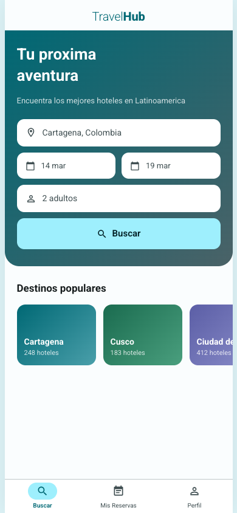

---

## 4. Resultados de búsqueda

### Descripción
Muestra un listado de alojamientos en formato de tarjetas con imagen, nombre, precio y valoración. Puede aplicar filtros y ordenar los resultados. Deslice hacia abajo para actualizar (pull-to-refresh).

### Paso a paso
1. Revise las tarjetas de alojamientos disponibles.
2. Utilice los **filtros** para refinar por precio, tipo de alojamiento, calificación y servicios.
3. Use las opciones de **ordenamiento** para organizar por precio, popularidad o calificación.
4. Toque cualquier tarjeta para ver el detalle de la propiedad.

### Captura de pantalla
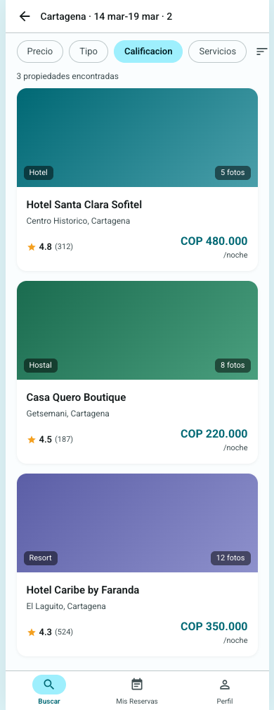

---

## 5. Detalle de propiedad

### Descripción
Presenta la información completa del alojamiento: galería de imágenes, descripción, amenidades, reseñas de otros viajeros, habitaciones disponibles y sus tarifas.

### Paso a paso
1. Desplace hacia abajo para explorar la **galería de imágenes**.
2. Lea la **descripción** del alojamiento y revise las **amenidades**.
3. Consulte las **reseñas** de otros huéspedes.
4. Revise las **habitaciones disponibles** con sus precios.
5. Toque el botón **Reservar** en la barra inferior para continuar con la reserva.

### Captura de pantalla
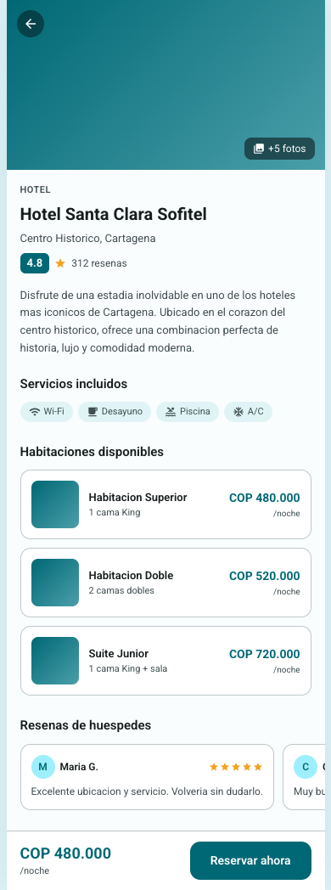

---

## 6. Resumen de reserva

### Descripción
Muestra un resumen con la habitación seleccionada, fechas, número de huéspedes y el total a pagar antes de confirmar la reserva. Requiere conexión a internet para procesar.

### Paso a paso
1. Verifique la **habitación** seleccionada.
2. Confirme las **fechas** de entrada y salida.
3. Revise el **número de huéspedes** y el **total** a pagar.
4. Toque **Confirmar** para proceder al pago.

### Captura de pantalla
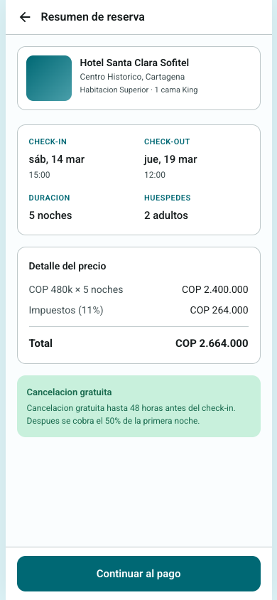

---

## 7. Pago

### Descripción
Permite seleccionar el método de pago e ingresar los datos necesarios para completar la transacción de la reserva desde la aplicación móvil.

### Paso a paso
1. Seleccione el **método de pago** (tarjeta de crédito o débito).
2. Ingrese los datos de la tarjeta: número, nombre del titular, fecha de vencimiento y código de seguridad.
3. Revise el **resumen del pedido**.
4. Toque **Confirmar pago** para procesar la transacción.

### Captura de pantalla
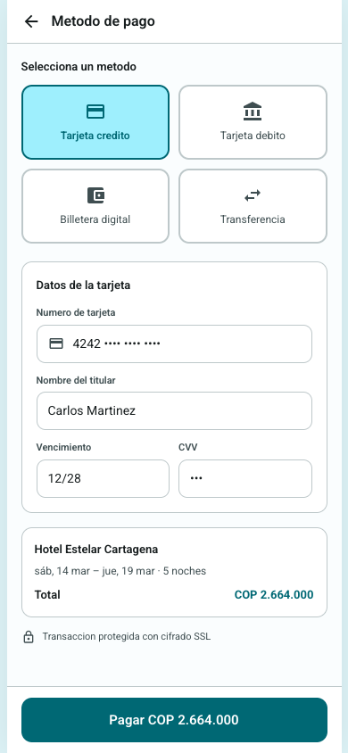

---

## 8. Reserva exitosa

### Descripción
Pantalla de confirmación que indica que la reserva se ha creado exitosamente. Incluye un resumen y un enlace directo a "Mis reservas".

### Paso a paso
1. Verifique el mensaje de **confirmación exitosa**.
2. Revise el resumen de su reserva.
3. Toque **Ver mis reservas** para consultar todas sus reservas.
4. Recibirá una notificación push y un correo electrónico con los detalles.

### Captura de pantalla
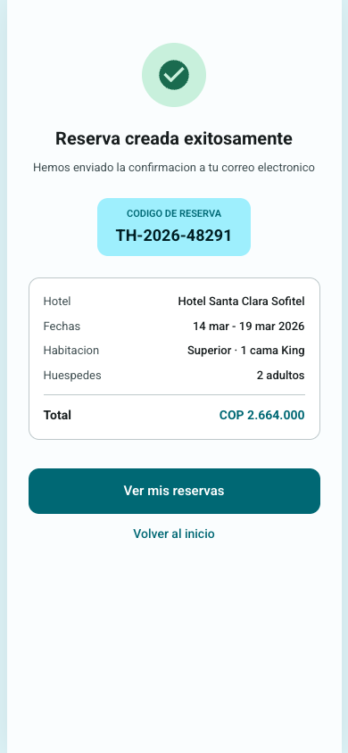

---

## 9. Mis reservas

### Descripción
Muestra el listado de todas sus reservas (activas y pasadas) con estado, fechas y hotel. Esta pantalla funciona sin conexión a internet utilizando datos almacenados en caché.

### Paso a paso
1. Acceda a **Mis reservas** desde el menú de navegación inferior.
2. Revise el listado con el estado de cada reserva (confirmada, pendiente, cancelada, completada).
3. Toque cualquier reserva para ver su detalle completo.
4. Si se encuentra sin conexión, verá un indicador de **"Datos sin conexión"**.

### Captura de pantalla
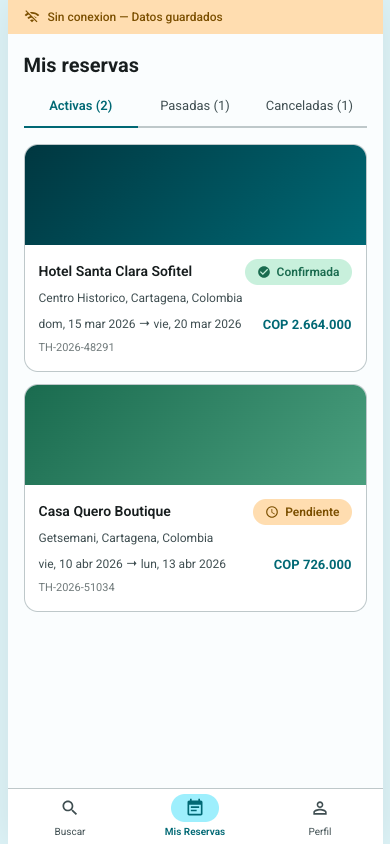

---

## 10. Detalle de reserva

### Descripción
Presenta la información completa de una reserva: dirección del hotel, número de confirmación, fechas, habitación, precio y estado. Disponible sin conexión desde datos almacenados en caché. Desde aquí puede cancelar la reserva o acceder al código QR de check-in.

### Paso a paso
1. Revise los datos de la reserva: hotel, dirección, habitación y fechas.
2. Consulte el **número de confirmación** y el **estado** de la reserva.
3. Para cancelar, toque el botón **Cancelar reserva**.
4. Para hacer check-in, toque el botón **Mostrar código QR** (disponible cuando el estado lo permite).

### Captura de pantalla
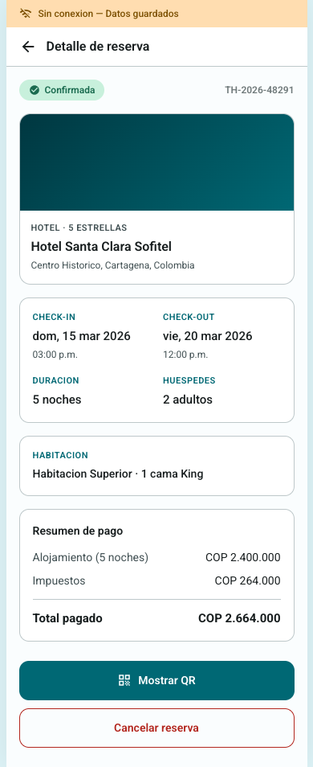

---

## 11. Cancelación de reserva

### Descripción
Permite cancelar una reserva activa directamente desde la aplicación. Muestra la política de cancelación y el desglose de reembolso antes de confirmar.

### Paso a paso
1. Desde el detalle de la reserva, toque **Cancelar reserva**.
2. Revise la **política de cancelación** aplicada.
3. Consulte el **monto de reembolso** y el método de devolución.
4. Toque **Confirmar cancelación** para proceder, o **Volver** para regresar.
5. El estado de la reserva se actualizará automáticamente, incluso en la caché local.

### Captura de pantalla
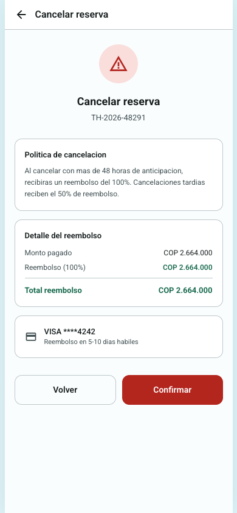

---

## 12. Check-in con código QR

### Descripción
Permite generar un código QR único desde el detalle de la reserva para presentarlo en la recepción del hotel y agilizar el proceso de registro sin necesidad de dictar datos o buscar documentos.

### Paso a paso
1. Desde el detalle de una reserva con estado **Confirmada**, toque **Mostrar código QR**.
2. Se desplegará una pantalla con el código QR en tamaño grande y alto contraste.
3. Presente el código QR en la recepción del hotel para completar el check-in.
4. El código contiene el identificador único de su reserva.

### Captura de pantalla
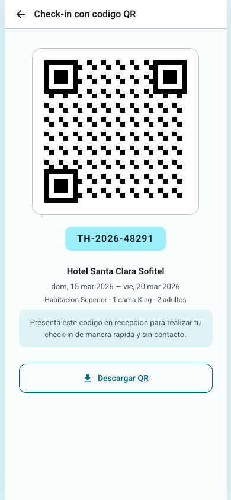

---

## 13. Perfil y preferencias

### Descripción
La sección de perfil permite consultar los datos de su cuenta y configurar preferencias de idioma y moneda para personalizar la experiencia en la aplicación.

### Paso a paso

#### Ver perfil
1. Toque el ícono de **Perfil** en el menú de navegación inferior.
2. Consulte sus datos de cuenta (nombre, correo electrónico).

#### Cambiar idioma
1. En la sección de perfil, toque la opción de **Idioma**.
2. Seleccione el idioma deseado (Español, English, Português).
3. La interfaz se actualizará automáticamente.

#### Cambiar moneda
1. En la sección de perfil, toque la opción de **Moneda**.
2. Seleccione la moneda deseada (COP, USD, MXN, ARS, CLP, PEN).
3. Los precios se mostrarán en la moneda seleccionada.

### Capturas de pantalla
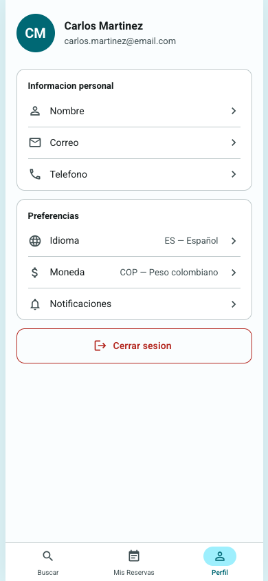

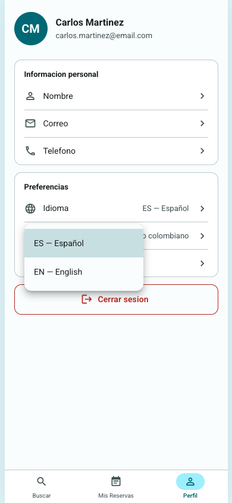

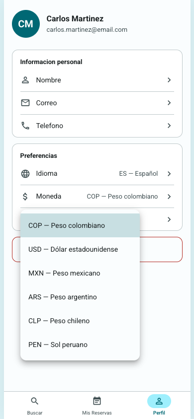
