# Manual de Usuario — Portal Web para Viajeros

## Introducción

El Portal Web para Viajeros de TravelHub permite buscar y reservar hospedaje en hoteles y alojamientos de Colombia, Perú, Ecuador, México, Chile y Argentina. Desde esta plataforma podrá explorar opciones de alojamiento, comparar precios, realizar reservas, gestionar pagos y consultar el estado de sus viajes.

## Requisitos previos

- Navegador web actualizado (Chrome, Firefox, Safari o Edge).
- Conexión a internet.
- Cuenta de usuario registrada en TravelHub (correo electrónico y contraseña).

---

## 1. Inicio de sesión

### Descripción
Permite acceder al portal con sus credenciales para consultar reservas y realizar nuevas búsquedas.

### Paso a paso
1. Abra el portal web de TravelHub en su navegador.
2. Ingrese su correo electrónico en el campo **Email**.
3. Ingrese su contraseña en el campo **Contraseña**.
4. Haga clic en el botón **Iniciar sesión**.
5. Será redirigido a la página de inicio (Home).

### Captura de pantalla
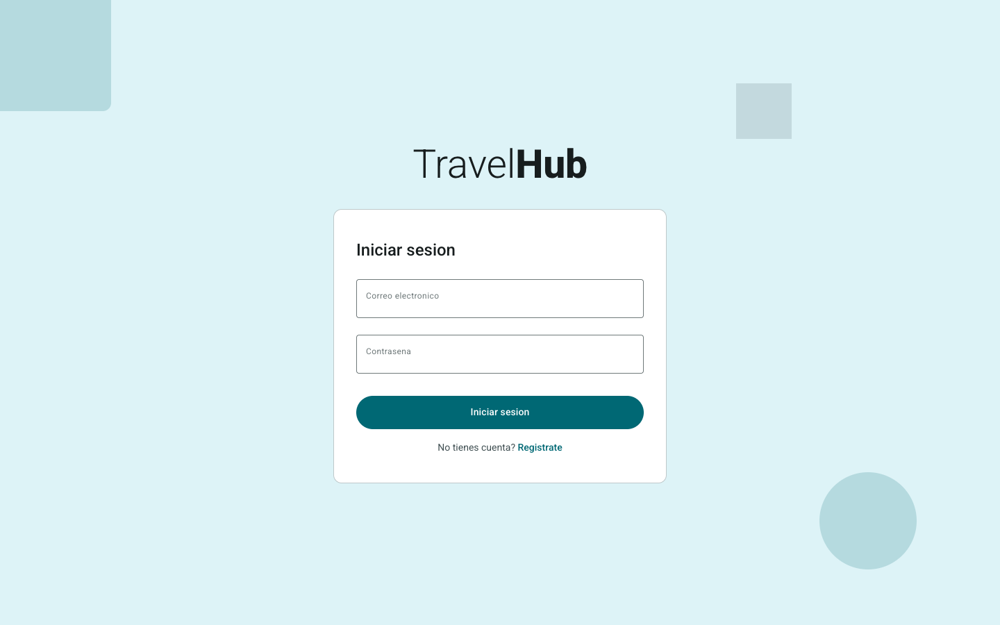

---

## 2. Registro de cuenta

### Descripción
Si aún no tiene una cuenta en TravelHub, puede crear una desde la pantalla de registro.

### Paso a paso
1. En la pantalla de inicio de sesión, haga clic en el enlace **Registrarse** o **Crear cuenta**.
2. Complete los campos solicitados: nombre, correo electrónico y contraseña.
3. Haga clic en **Registrarse** para crear su cuenta.
4. Una vez registrado, será redirigido al portal para iniciar sesión.

### Captura de pantalla
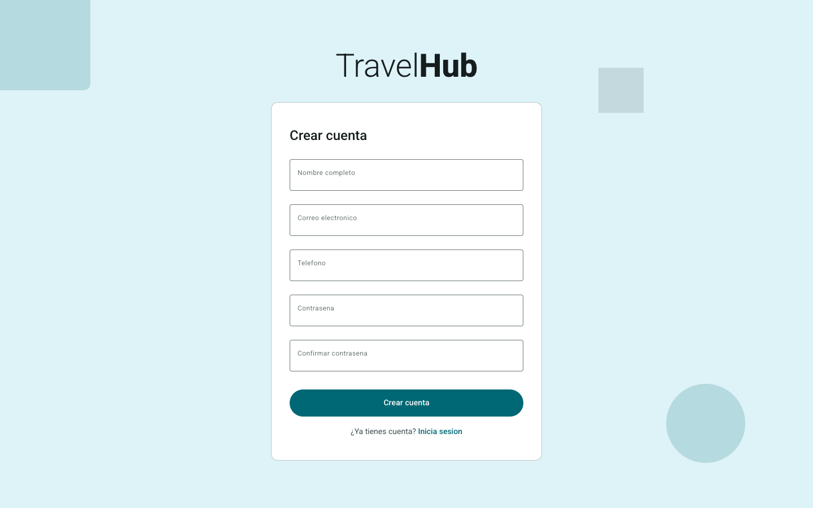

---

## 3. Búsqueda de hospedaje

### Descripción
La página de inicio permite buscar alojamientos disponibles ingresando destino, fechas de viaje y número de huéspedes. También muestra hoteles destacados para inspirar su búsqueda.

### Paso a paso
1. En la página de inicio, ubique la barra de búsqueda.
2. Ingrese el **destino** (ciudad o región) en el campo correspondiente.
3. Seleccione las **fechas de entrada y salida** usando el selector de fechas.
4. Indique el **número de huéspedes**.
5. Haga clic en el botón **Buscar**.
6. Será dirigido a la página de resultados de búsqueda.

### Captura de pantalla
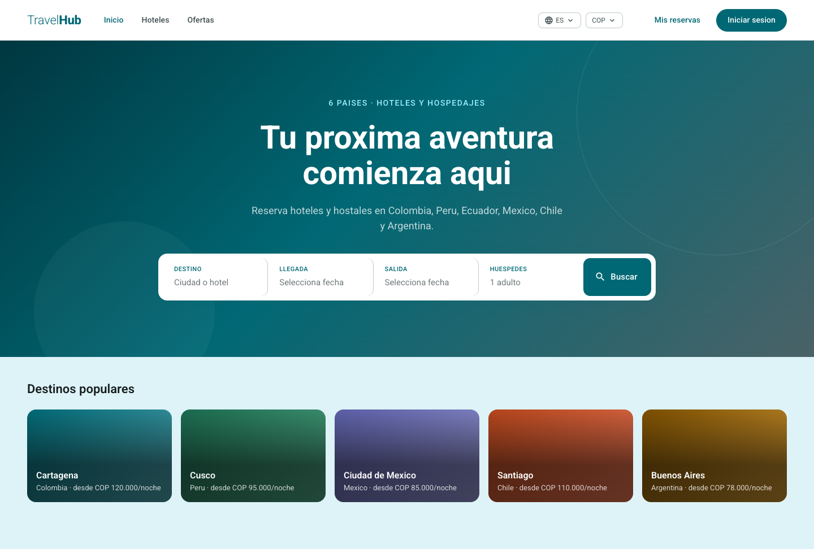

---

## 4. Resultados de búsqueda

### Descripción
Muestra un listado de alojamientos que coinciden con los criterios de búsqueda. Puede aplicar filtros y ordenar los resultados para encontrar la opción ideal.

### Paso a paso
1. Revise el listado de alojamientos disponibles.
2. Use los **filtros laterales** para refinar los resultados por:
   - Rango de precio.
   - Calificación (estrellas).
   - Amenidades (WiFi, piscina, estacionamiento, etc.).
3. Utilice las opciones de **ordenamiento** para organizar por precio o calificación.
4. Haga clic en cualquier alojamiento para ver su detalle completo.

### Captura de pantalla
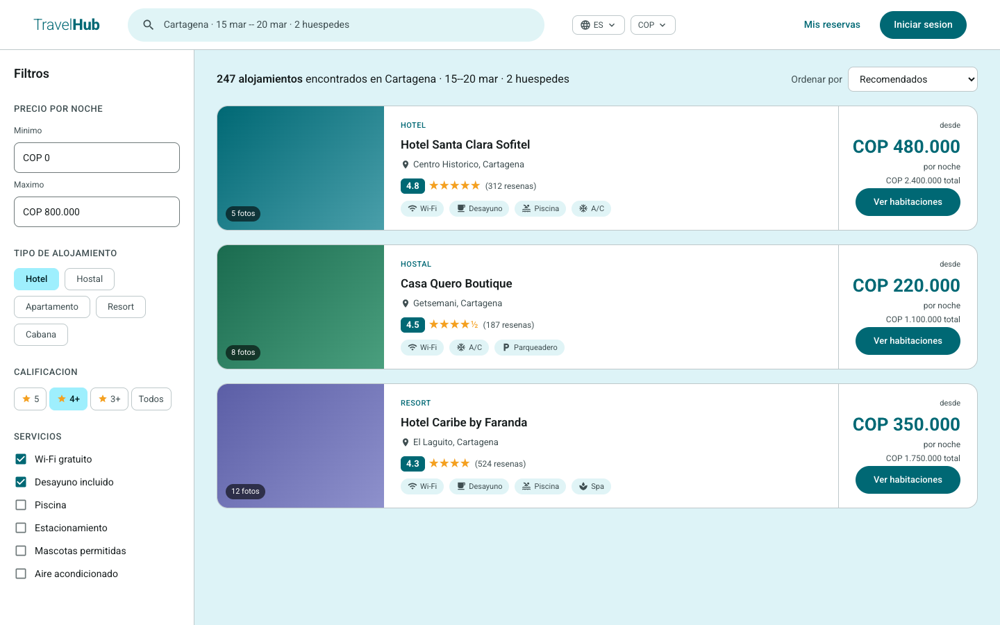

---

## 5. Detalle de propiedad

### Descripción
Presenta la información completa de un alojamiento: galería de imágenes, descripción, amenidades, habitaciones disponibles con precios, reseñas de otros viajeros y ubicación.

### Paso a paso
1. Explore la **galería de imágenes** del alojamiento.
2. Lea la **descripción** y revise las **amenidades** disponibles.
3. Consulte las **reseñas** de otros huéspedes.
4. Revise las **habitaciones disponibles** con sus tarifas.
5. Seleccione la habitación deseada y haga clic en **Agregar al carrito** o **Reservar**.

### Captura de pantalla
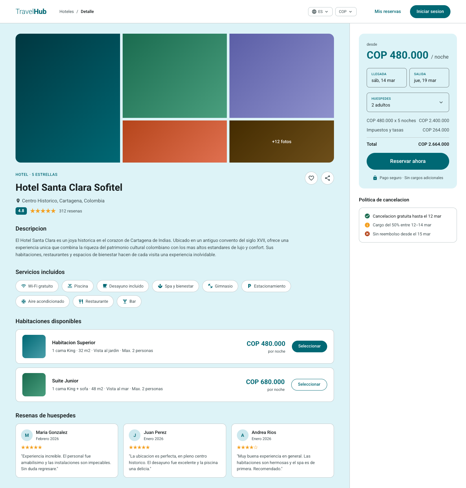

---

## 6. Carrito de reserva

### Descripción
Muestra un resumen de las habitaciones seleccionadas con fechas, desglose de precios y el total a pagar antes de proceder al pago.

### Paso a paso
1. Revise las habitaciones agregadas al carrito.
2. Verifique las **fechas** de entrada y salida.
3. Consulte el **desglose de precios** (tarifa por noche, impuestos, descuentos si aplica).
4. Confirme el **total** a pagar.
5. Haga clic en **Proceder al pago** para continuar.

### Captura de pantalla
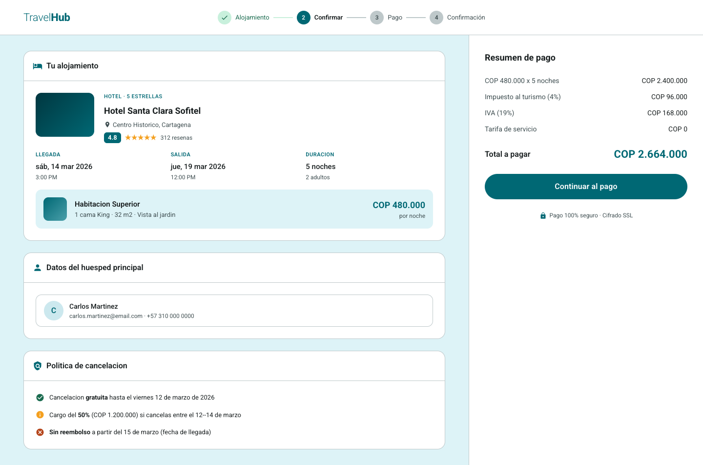

---

## 7. Pago

### Descripción
Permite seleccionar el método de pago e ingresar los datos de facturación para completar la transacción de su reserva.

### Paso a paso
1. Seleccione el **método de pago** (tarjeta de crédito o débito).
2. Ingrese los datos de la tarjeta: número, nombre del titular, fecha de vencimiento y código de seguridad.
3. Revise el **resumen del pedido** en el panel lateral.
4. Haga clic en **Confirmar pago** para procesar la transacción.

### Captura de pantalla
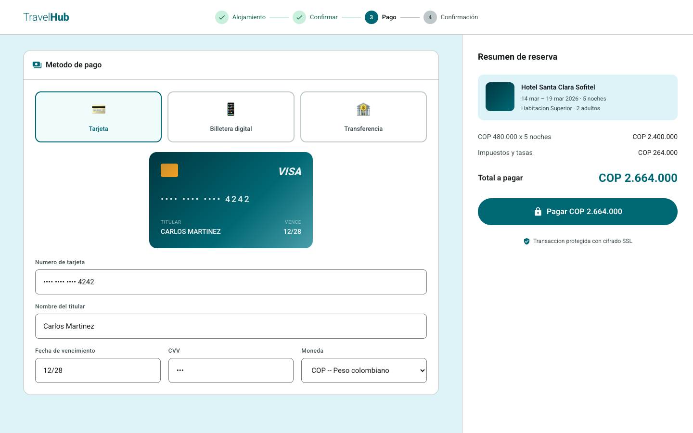

---

## 8. Confirmación de reserva

### Descripción
Una vez procesado el pago exitosamente, se muestra una pantalla de confirmación con el resumen de la reserva y los próximos pasos.

### Paso a paso
1. Verifique el **número de confirmación** de su reserva.
2. Revise el resumen: hotel, habitación, fechas y monto pagado.
3. Recibirá un correo electrónico con los detalles de la reserva.
4. Puede hacer clic en **Ver mis reservas** para consultar todas sus reservas.

### Captura de pantalla
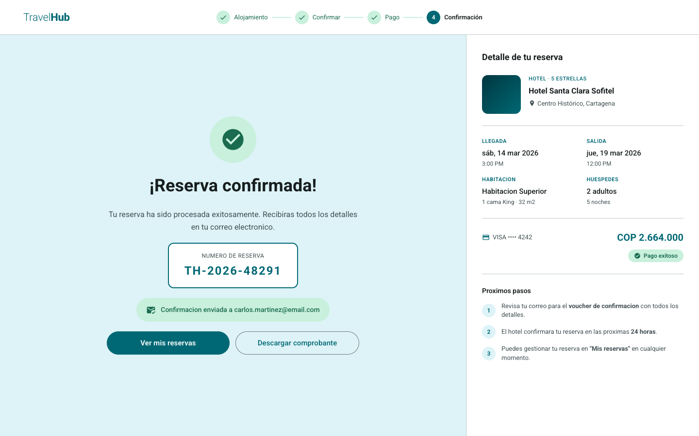

---

## 9. Mis reservas

### Descripción
Muestra el listado de todas sus reservas (activas y pasadas) con el estado, hotel y fechas de cada una.

### Paso a paso
1. Acceda a **Mis reservas** desde el menú de navegación.
2. Revise el listado de reservas con su estado (confirmada, pendiente, cancelada, completada).
3. Haga clic en cualquier reserva para ver su detalle completo.

### Captura de pantalla
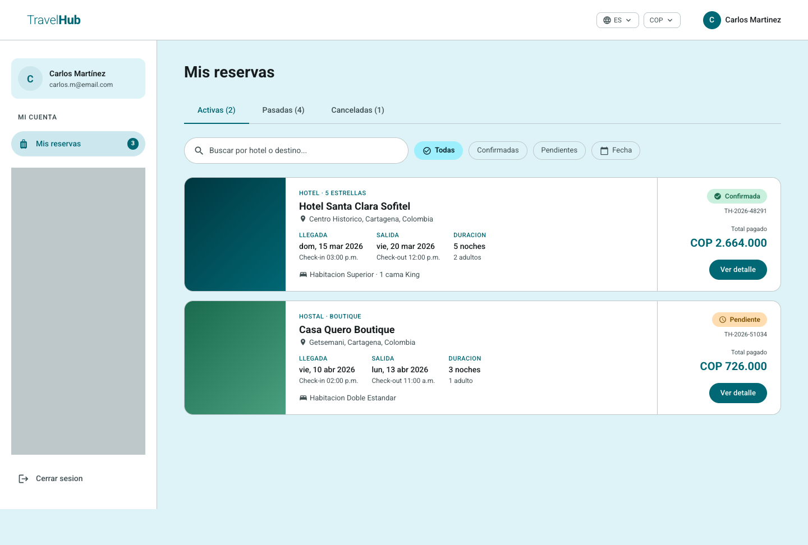

---

## 10. Detalle de reserva

### Descripción
Presenta la información completa de una reserva: hotel, habitación, fechas, huéspedes, estado actual e historial de pagos. Desde aquí puede confirmar o cancelar la reserva.

### Paso a paso
1. Revise los datos de la reserva: hotel, habitación, fechas de estadía y número de huéspedes.
2. Consulte el **estado actual** de la reserva.
3. Revise el **historial de pagos** asociado.
4. Si desea cancelar, haga clic en el botón **Cancelar reserva**.

### Captura de pantalla
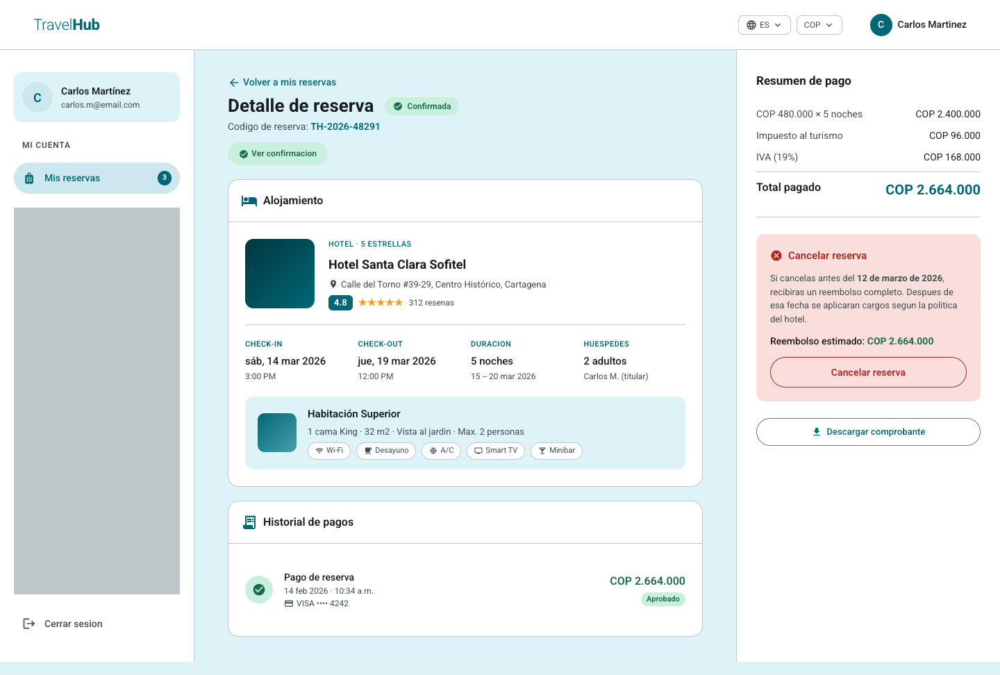

---

## 11. Confirmación de reserva (modal)

### Descripción
Modal que se muestra sobre el detalle de la reserva confirmando el pago exitoso, con un resumen de la reserva y notificación por correo electrónico.

### Paso a paso
1. Tras confirmar una reserva, se despliega automáticamente el modal de confirmación.
2. Verifique el resumen de la reserva y el estado del pago.
3. Se enviará una notificación por correo electrónico con los detalles.
4. Cierre el modal para volver al detalle de la reserva.

### Captura de pantalla
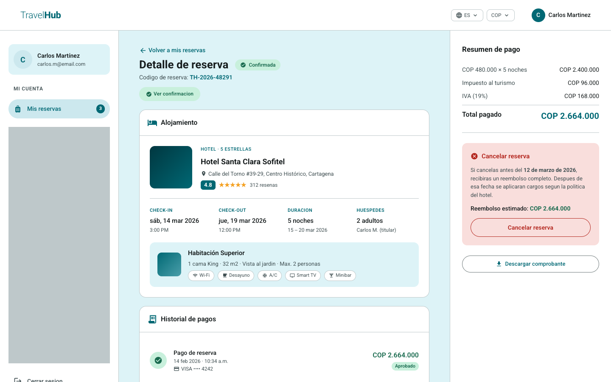

---

## 12. Cancelación de reserva

### Descripción
Modal que permite cancelar una reserva activa. Muestra la política de cancelación aplicada, el desglose del reembolso, el método de devolución y el tiempo estimado.

### Paso a paso
1. Desde el detalle de la reserva, haga clic en **Cancelar reserva**.
2. Revise la **política de cancelación** aplicada.
3. Consulte el **desglose del reembolso** (monto a devolver, cargos por cancelación si aplica).
4. Verifique el **método de devolución** y el tiempo estimado de reembolso.
5. Haga clic en **Confirmar cancelación** para proceder, o en **Volver** para regresar.

### Captura de pantalla
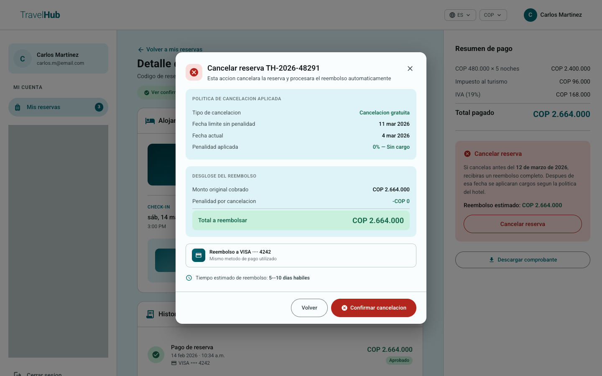

---

## 13. Preferencias de idioma y moneda

### Descripción
TravelHub permite cambiar el idioma de la interfaz y la moneda de visualización de precios para adaptarse a las preferencias del usuario.

### Paso a paso

#### Cambiar idioma
1. Haga clic en el selector de idioma ubicado en el menú de navegación.
2. Seleccione el idioma deseado (Español, English, Português).
3. La interfaz se actualizará automáticamente al idioma seleccionado.

#### Cambiar moneda
1. Haga clic en el selector de moneda en el menú de navegación.
2. Seleccione la moneda deseada (COP, USD, MXN, ARS, CLP, PEN).
3. Los precios mostrados se actualizarán a la moneda seleccionada.

### Capturas de pantalla
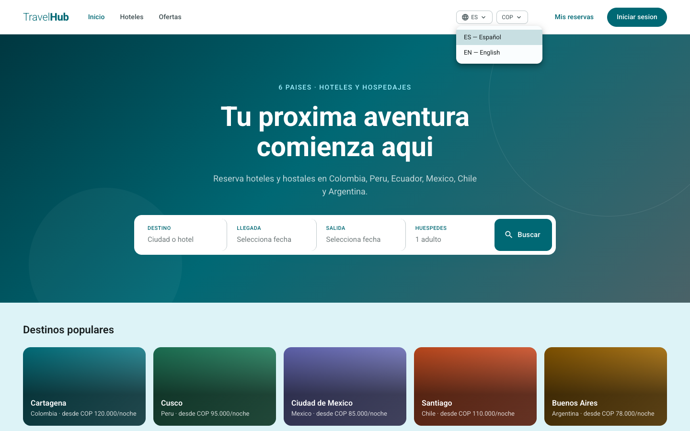

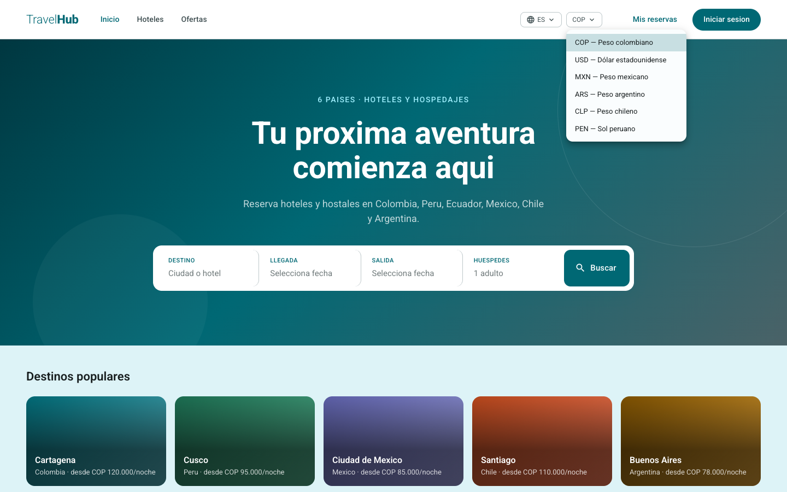
